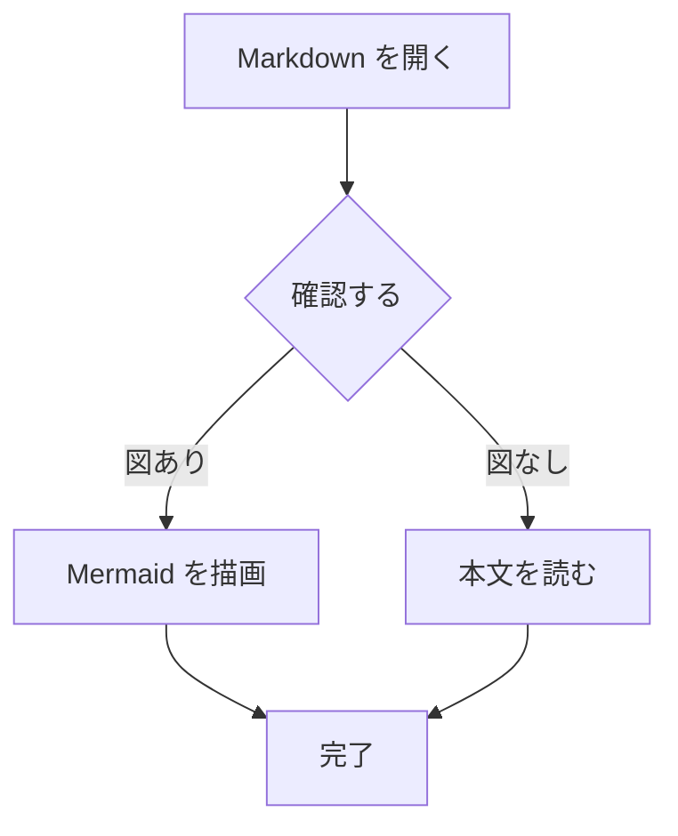
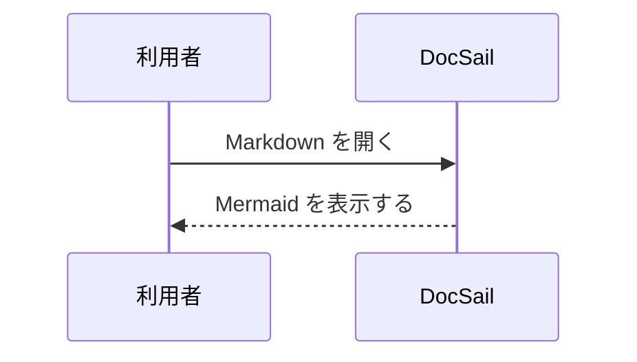
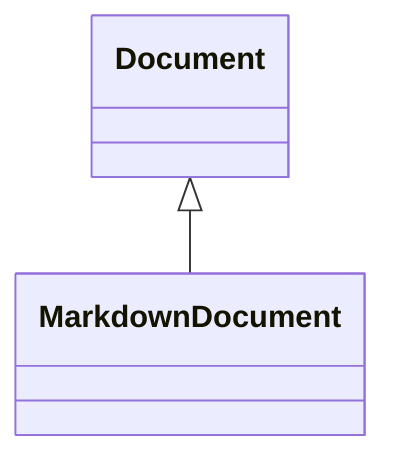

# GFM プレビュー確認

DocSail の Markdown プレビューを確認するためのサンプルです。

## 見出しレベル

H1 は上下の太線、H2 は下線、H3 は太字、H4〜H6 は `▸` 付きで表示されます。

### H3: セクション

#### H4: 小見出し

##### H5: 詳細見出し

###### H6: 最小見出し

## 見出しとインライン

通常の文章です。*斜体*、**太字**、~~取り消し線~~、`inline code` を表示します。

改行だけの行は段落内の空白として扱います。
この行は同じ段落の続きです。  
この行の前には hard break があります。

## リンクと画像

[通常のリンク](https://example.com/path) と <https://example.com/autolink> です。


## リスト

- 箇条書き
- **装飾を含む** 項目
  - ネストした項目
  - `code` を含む項目
- 最後の項目

3. 開始番号を保持する番号付きリスト
4. 次の項目

- [x] 完了したタスク
- [ ] 未完了のタスク

## 引用

> 通常の引用です。
>
> > ネストした引用です。

## コードブロック

```rust
fn main() {
    println!("Hello, DocSail!");
}
```

## Mermaid

`m` で描画表示とソース表示を切り替えます。flowchart と sequenceDiagram は描画対象です。





次の図種は v0.3 の品質保証対象外のため、Mermaid ソースとして表示されます。



## 表

| 左揃え | 中央揃え | 右揃え |
| :--- | :---: | ---: |
| plain | **bold** | 42 |
| 日本語 | `code` | 900 |

---

## HTML のフォールバック

<span class="notice">HTML はリテラルとして表示します。</span>

<div>
HTML block もリテラルとして表示します。
</div>

## 未対応の GFM autolink 確認

次の裸 URL とメールアドレスは、現在は通常テキストとして表示されます。

<https://example.com/bare-url>

<https://www.example.com>

<hello@example.com>
